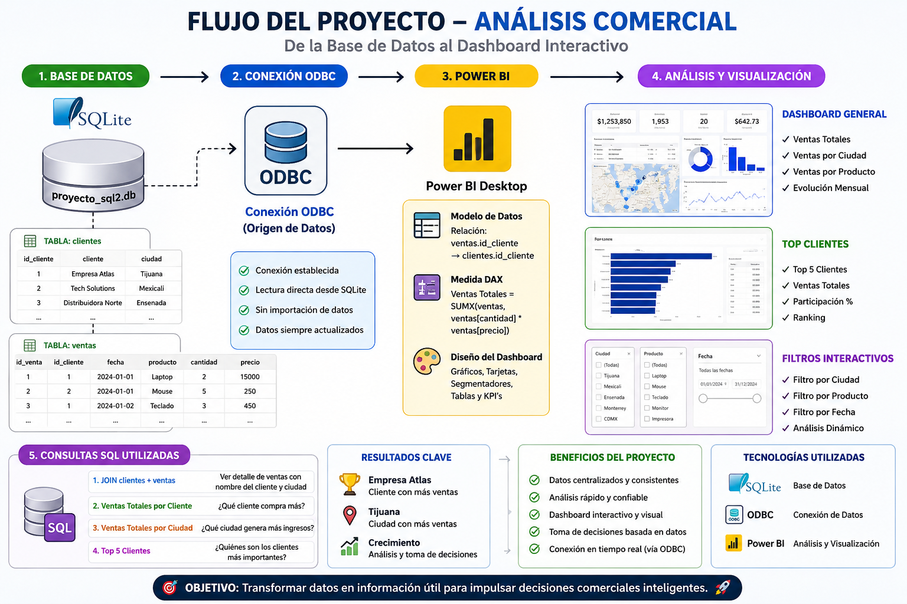
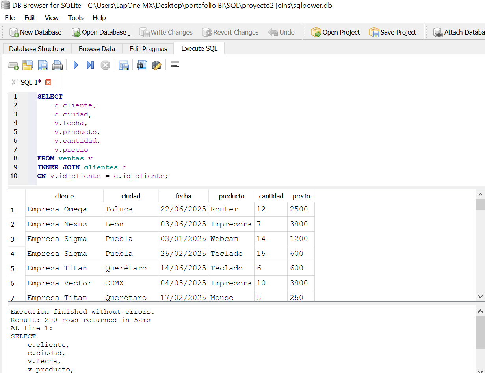
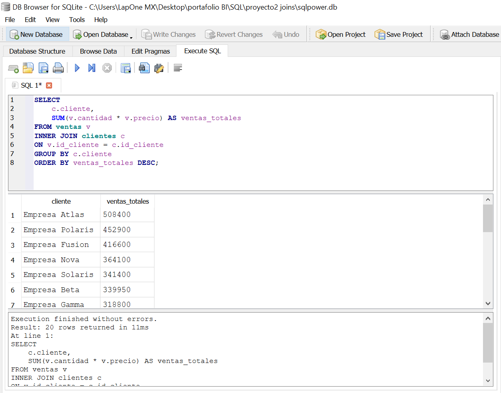
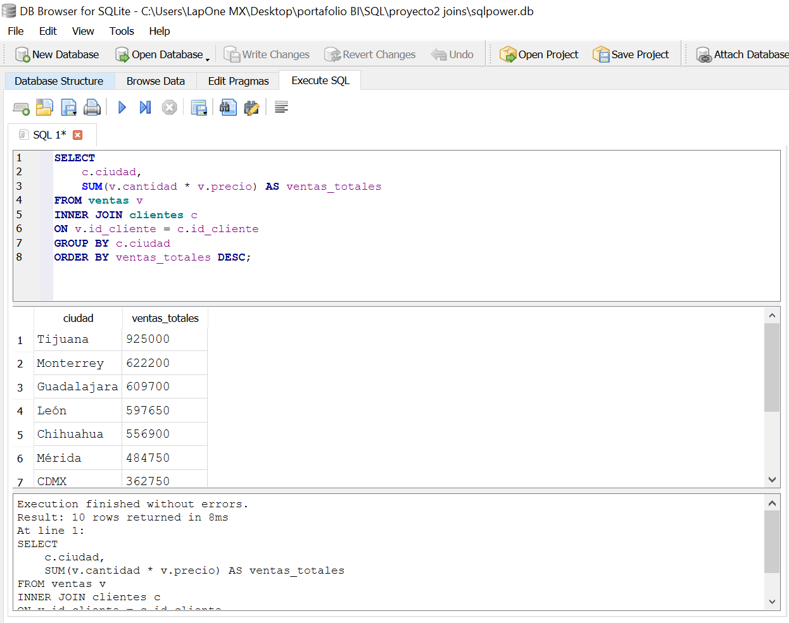
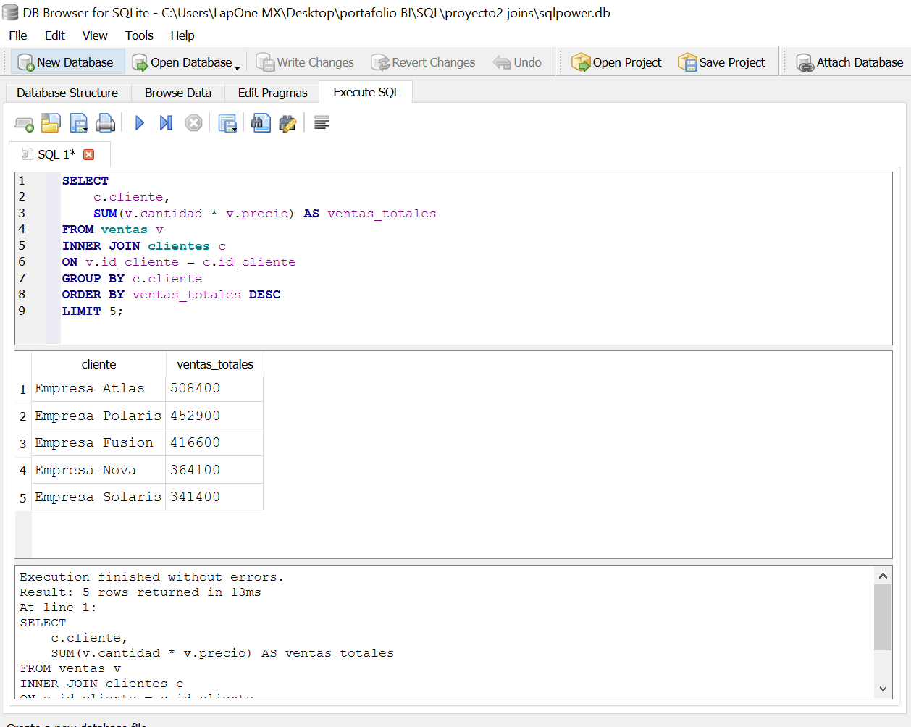
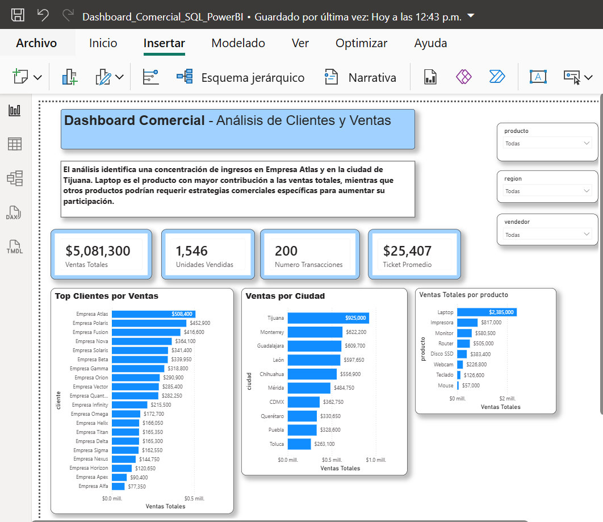
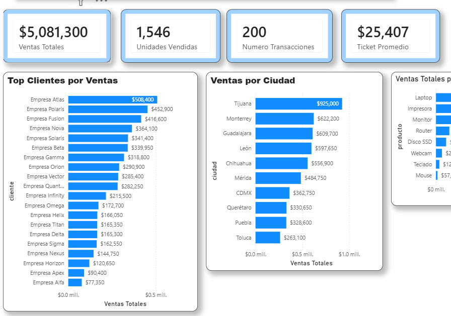
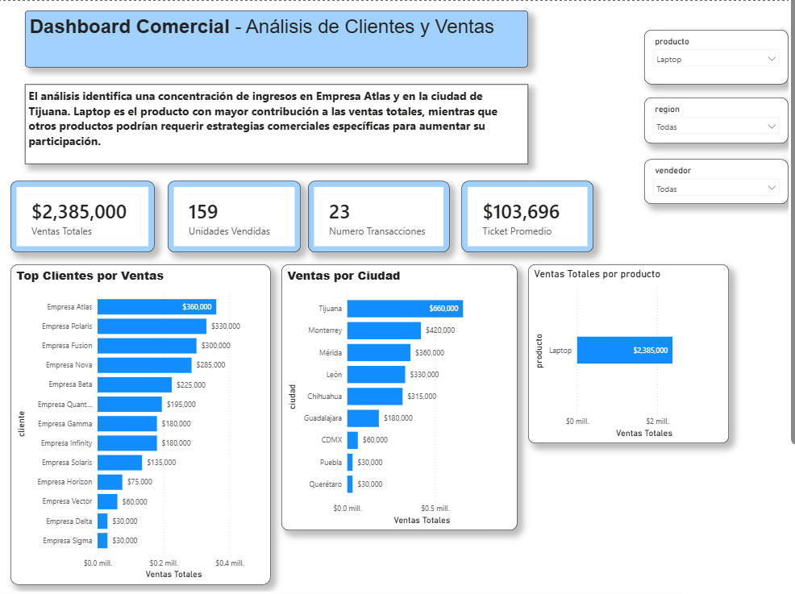

# Dashboard Comercial SQL + Power BI

## Descripción del Proyecto

Proyecto de análisis de datos desarrollado utilizando SQLite, SQL, ODBC y Power BI para transformar datos transaccionales en información útil para la toma de decisiones.

El objetivo fue construir una solución completa de análisis comercial, desde la base de datos hasta la visualización final en Power BI.

---

# Flujo del Proyecto



### Flujo de trabajo

SQLite → SQL → ODBC → Power Query → Modelo de Datos → DAX → Dashboard Power BI

---

# Tecnologías Utilizadas

* SQLite
* SQL
* ODBC
* Power Query
* Power BI
* DAX
* GitHub

---

# Objetivos del Proyecto

* Analizar el comportamiento de ventas.
* Identificar clientes con mayor contribución a los ingresos.
* Detectar ciudades con mejor desempeño comercial.
* Analizar productos con mayor generación de ingresos.
* Construir un dashboard interactivo para la exploración de datos.

---

# Modelo de Datos

## Tabla Clientes

Contiene información descriptiva de los clientes:

* id_cliente
* cliente
* ciudad

## Tabla Ventas

Contiene información transaccional:

* id_cliente
* fecha
* vendedor
* region
* producto
* cantidad
* precio

---

# Consultas SQL Utilizadas

## INNER JOIN Clientes y Ventas

Permite enriquecer la información de ventas con los datos de cliente y ciudad.



---

## Ventas Totales por Cliente

Identifica los clientes con mayor generación de ingresos.



---

## Ventas Totales por Ciudad

Permite detectar las ciudades con mejor desempeño comercial.



---

## Top 5 Clientes

Permite priorizar los clientes más importantes para el negocio.



---

# Dashboard en Power BI

## KPIs Implementados

* Ventas Totales
* Unidades Vendidas
* Número de Transacciones
* Ticket Promedio

---

## Dashboard General



---

## Top Clientes



---

## Filtros Interactivos

Filtros implementados:

* Producto
* Región
* Vendedor



---

# Medidas DAX Utilizadas

### Ventas Totales

```DAX
Ventas Totales =
SUMX(
    ventas,
    ventas[cantidad] * ventas[precio]
)
```

### Unidades Vendidas

```DAX
Unidades Vendidas =
SUM(ventas[cantidad])
```

### Número de Transacciones

```DAX
Numero Transacciones =
COUNTROWS(ventas)
```

### Ticket Promedio

```DAX
Ticket Promedio =
DIVIDE(
    [Ventas Totales],
    [Numero Transacciones]
)
```

---

# Hallazgos Principales

### Cliente con mayores ventas

🏆 Empresa Atlas

### Ciudad con mayores ventas

🏆 Tijuana

### Producto con mayores ingresos

🏆 Laptop

---

# Insight de Negocio

El análisis identifica una concentración de ingresos en Empresa Atlas y en la ciudad de Tijuana. Laptop destaca como el producto con mayor contribución a las ventas totales, mientras que otros productos podrían requerir estrategias comerciales específicas para incrementar su participación.

---

# Habilidades Demostradas

* SQL
* INNER JOIN
* GROUP BY
* ORDER BY
* LIMIT
* SQLite
* ODBC
* Power Query
* Modelado de Datos
* DAX
* Power BI
* Diseño de Dashboards
* Storytelling con Datos

---

# Estructura del Proyecto

```text
SQL-PowerBI-Proyecto-Clientes-Ventas
│
├── Dashboard_Comercial_SQL_PowerBI.pbix
├── proyecto_sql2.db
├── README.md
│
├── flujo_proyecto_sql_powerbi.png
│
├── sql_join_clientes_ventas.png
├── sql_ventas_por_cliente.png
├── sql_ventas_por_ciudad.png
├── sql_top5_clientes.png
│
├── dashboard_general.png
├── dashboard_top_clientes.png
└── dashboard_filtros.png
```

---

# Autor

Joshua

Proyecto desarrollado como parte de mi portafolio de Analista de Datos.
